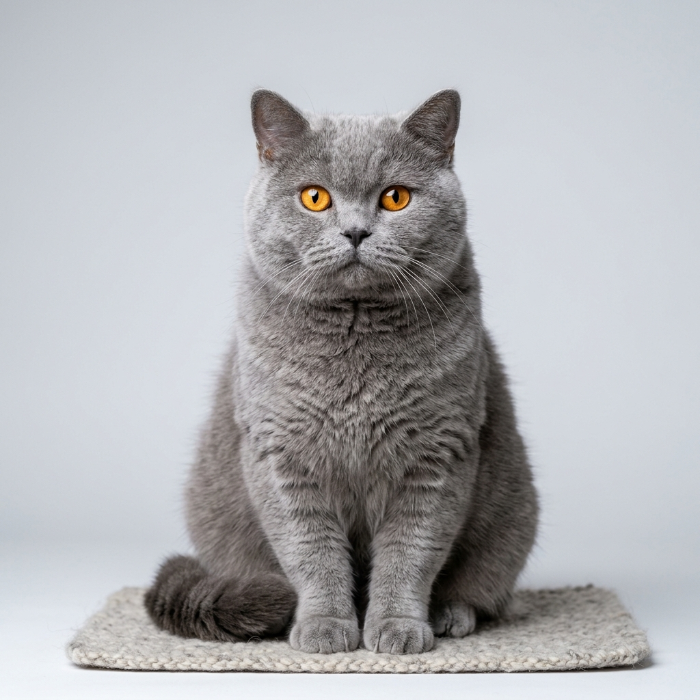
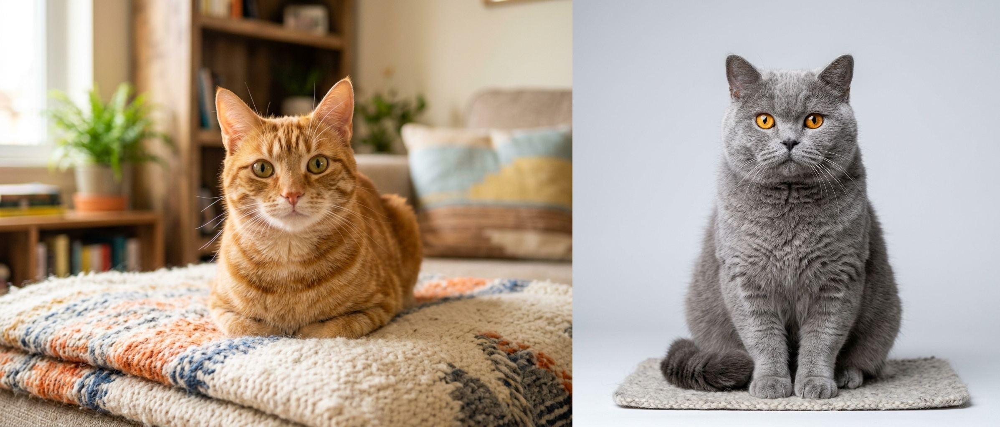

# FATEC-FV - Visão Computacional: Concatenação de Imagens com OpenCV

Projeto prático desenvolvido para a disciplina de **Visão Computacional** da **FATEC Faculdade de Tecnologia de Ferraz de Vasconcelos**.

O objetivo deste projeto é demonstrar as técnicas fundamentais de manipulação matricial de imagens em Python, com foco em:
1. **Preservação de Proporção Dimensional (*Aspect Ratio*)** ao redimensionar imagens.
2. **Concatenação Horizontal** de matrizes utilizando `cv2.hconcat`.
3. **Concatenação Vertical** de matrizes utilizando `cv2.vconcat`.
4. **Interatividade em tempo real** com interface gráfica OpenCV e atalhos de teclado.

---

## 📸 Demonstração Visual

| Imagem 1 (`cat_1.jpg`) | Imagem 2 (`cat_2.jpg`) |
| :---: | :---: |
| `1200 x 896 px` | `1024 x 1024 px` |
|  |  |

### Resultado: Concatenação Horizontal
A Imagem 1 é redimensionada proporcionalmente para a altura da Imagem 2 ($1024\text{ px}$), resultando em uma imagem combinada de $2395 \times 1024\text{ px}$:



---

## 📐 Fundamentação Teórica

### 1. Representação de Imagens como Matrizes NumPy
Em Visão Computacional, uma imagem digital colorida é representada como um tensor tridimensional com formato:
$$\text{shape} = (H, W, C)$$
- **$H$ (Altura / *Height*)**: número de linhas da matriz de pixels.
- **$W$ (Largura / *Width*)**: número de colunas da matriz de pixels.
- **$C$ (Canais / *Channels*)**: número de canais de cor (no OpenCV, a ordem padrão é **BGR** – Blue, Green, Red, com $C = 3$).

### 2. Concatenação Horizontal (`cv2.hconcat`)
Para posicionar duas imagens lado a lado, as matrizes precisam ter **rigorosamente o mesmo número de linhas ($H$)**:

$$\text{Condição Necessária: } H_1 = H_2$$

Se as alturas diferirem, ocorre um erro de incompatibilidade de dimensões. O resultado terá dimensões:
$$\text{Shape Resultante: } (H_2, W_1' + W_2, C)$$

### 3. Concatenação Vertical (`cv2.vconcat`)
Para empilhar duas imagens uma sobre a outra, as matrizes precisam ter **o mesmo número de colunas ($W$)**:

$$\text{Condição Necessária: } W_1 = W_2$$

Se as larguras diferirem, o resultado terá dimensões:
$$\text{Shape Resultante: } (H_1' + H_2, W_2, C)$$

### 4. Preservação da Proporção (*Aspect Ratio*)
Redimensionar uma imagem sem considerar a proporção original gera distorções visuais (efeito "esticado" ou "achatado"). Para preservar o *aspect ratio*:

$$\text{Aspect Ratio } (AR) = \frac{W_{\text{original}}}{H_{\text{original}}}$$

- **Para igualar a altura ($H_{\text{alvo}}$)**:
  $$\text{Fator de Escala } s = \frac{H_{\text{alvo}}}{H_{\text{original}}}$$
  $$W_{\text{novo}} = \text{round}(W_{\text{original}} \times s)$$

- **Para igualar a largura ($W_{\text{alvo}}$)**:
  $$\text{Fator de Escala } s = \frac{W_{\text{alvo}}}{W_{\text{original}}}$$
  $$H_{\text{novo}} = \text{round}(H_{\text{original}} \times s)$$

### 5. `cv2.hconcat` vs `np.hstack`
- `cv2.hconcat` e `cv2.vconcat`: Funções nativas do OpenCV, altamente otimizadas para matrizes de imagens do tipo `uint8` contíguas em memória.
- `np.hstack` e `np.vstack`: Funções genéricas da biblioteca NumPy que operam concatenando eixos de arrays (`np.concatenate(..., axis=1)` ou `axis=0`). Ambas produzem resultados equivalentes quando as matrizes têm tipos e formas compatíveis.

---

## 🛠️ Estrutura do Projeto

```text
FATEC-FV_VC_003_Concatenação_imagens/
├── assets/
│   ├── cat_1.jpg                   # Amostra 1 (1200x896 px)
│   ├── cat_2.jpg                   # Amostra 2 (1024x1024 px)
│   ├── resultado_concatenado.jpg   # Resultado gerado (Horizontal)
│   └── resultado_vertical.jpg      # Resultado gerado (Vertical)
├── concatenacao_imagens.py         # Código-fonte principal da aplicação
├── requirements.txt                # Dependências Python (opencv-python, numpy)
├── .gitignore                      # Regras de exclusão do repositório Git
└── README.md                       # Documentação do projeto
```

---

## 🚀 Como Executar

### 1. Criar e Ativar o Ambiente Virtual

No terminal Linux/macOS:
```bash
python3 -m venv venv
source venv/bin/activate
```

No Windows (PowerShell):
```powershell
python -m venv venv
.\venv\Scripts\Activate.ps1
```

### 2. Instalar as Dependências

```bash
pip install -r requirements.txt
```

### 3. Executar o Script

Execução padrão (abre a janela interativa com `assets/cat_1.jpg` e `assets/cat_2.jpg`):
```bash
python3 concatenacao_imagens.py
```

---

## ⌨️ Atalhos de Teclado na Janela

Quando a janela gráfica do OpenCV estiver aberta, você pode utilizar os seguintes atalhos:

| Tecla | Ação |
| :---: | :--- |
| <kbd>H</kbd> | Alterna a visualização para **Concatenação Horizontal** |
| <kbd>V</kbd> | Alterna a visualização para **Concatenação Vertical** |
| <kbd>S</kbd> | Salva a imagem atual em disco (`assets/resultado_[modo].jpg`) |
| <kbd>Q</kbd> ou <kbd>ESC</kbd> | Fecha a janela e encerra o programa |

---

## ⚙️ Opções via Linha de Comando (CLI)

O script aceita diversos parâmetros customizados:

```bash
# Informar imagens personalizadas
python3 concatenacao_imagens.py --img1 caminho/minha_foto1.jpg --img2 caminho/minha_foto2.jpg

# Iniciar diretamente no modo vertical
python3 concatenacao_imagens.py --modo vertical

# Salvar o resultado automaticamente em um caminho personalizado
python3 concatenacao_imagens.py --salvar --saida assets/painel_comparativo.jpg

# Executar sem abrir janela (ideal para automações e servidores sem display)
python3 concatenacao_imagens.py --sem-janela --salvar
```

### Lista Completa de Argumentos

| Parâmetro | Atalho | Padrão | Descrição |
| :--- | :---: | :--- | :--- |
| `--img1` | `-i1` | `assets/cat_1.jpg` | Caminho para a primeira imagem |
| `--img2` | `-i2` | `assets/cat_2.jpg` | Caminho para a segunda imagem |
| `--modo` | `-m` | `horizontal` | Modo inicial (`horizontal` ou `vertical`) |
| `--salvar` | `-s` | *False* | Se presente, salva o resultado em disco |
| `--saida` | `-o` | `assets/resultado_concatenado.jpg` | Caminho de destino do arquivo salvo |
| `--sem-janela` | - | *False* | Executa sem interface gráfica |

---

## 🛡️ Mecanismo de Fallback

Caso nenhuma imagem seja encontrada nos caminhos indicados, o script **não quebra**: ele ativa automaticamente um gerador sintético de imagens coloridas com gradientes e formas geométricas (`criar_imagens_demonstracao()`), garantindo que o programa execute normalmente e sirva para propósitos didáticos em qualquer máquina.

---

## 👨‍💻 Autor & Disciplina

- **Autor**: Josias Sobrinho
- **Professora**: Marcia Bissaco
- **Instituição**: FATEC - Faculdade de Tecnologia de Ferraz de Vasconcelos
- **Curso**: Análise e Desenvolvimento de Sistemas
- **Disciplina**: Visão Computacional
- **Tecnologias**: Python 3, OpenCV (Open Source Computer Vision Library), NumPy
