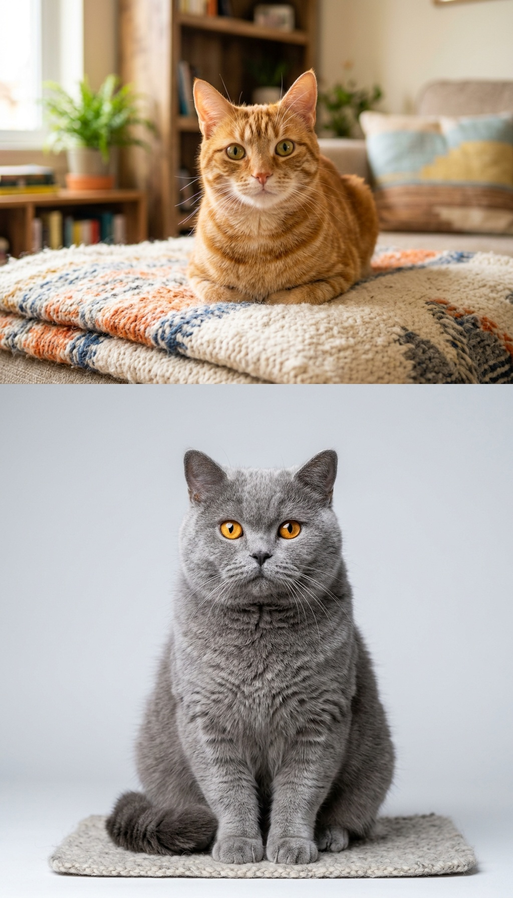

# Plano de Implementação - Concatenação de Imagens com OpenCV (FATEC-FV)

Este projeto tem como objetivo consolidar os conceitos de manipulação de matrizes de imagens, cálculo de proporção (*aspect ratio*), redimensionamento dimensional e concatenação horizontal e vertical com **OpenCV** e **NumPy**.

O script inicial em [concatenacao_imagens.py](file:///var/www/html/Visão%20Computacional/FATEC-FV_VC_003_Concatenação_imagens/concatenacao_imagens.py) tenta ler os arquivos `assets/cat_1.jpg` e `assets/cat_2.jpg`, que ainda não existem no diretório, causando o erro de execução observado.

---

## User Review Required

> [!NOTE]
> O ambiente já possui um ambiente virtual Python configurado (`venv`) com **Python 3.13**, **OpenCV 5.0.0** e **NumPy 2.5.2**.

> [!TIP]
> Vamos fornecer duas imagens de gatos de alta qualidade com dimensões distintas na pasta `assets/` para demonstrar na prática o redimensionamento mantendo a proporção correta antes da concatenação.

---

## Proposta de Implementação

### 1. Estrutura do Código em `concatenacao_imagens.py`
O script será organizado de forma modular, didática e robusta, incluindo:
- **Modularização de Funções**:
  - `carregar_imagem(caminho)`: validação do caminho e tratamento de erro informativo.
  - `redimensionar_por_altura(imagem, altura_alvo)`: preserva a proporção (*aspect ratio*) ao ajustar a altura.
  - `redimensionar_por_largura(imagem, largura_alvo)`: preserva a proporção ao ajustar a largura.
  - `concatenar(img1, img2, modo='horizontal')`: suporte a concatenação horizontal (`cv2.hconcat`) e vertical (`cv2.vconcat`).
  - `gerar_imagens_sinteticas()`: fallback inteligente caso o usuário execute o script sem imagens no diretório.
- **Linha de Comando (`argparse`)**:
  - Execução padrão sem parâmetros: abre `assets/cat_1.jpg` e `assets/cat_2.jpg`.
  - Opções flexíveis: `--img1`, `--img2`, `--modo` (`horizontal`, `vertical`, `ambos`), `--salvar`.
- **Interatividade na Janela OpenCV**:
  - Exibição de informações no terminal (dimensões originais e finais de cada matriz).
  - Atalhos de teclado no `cv2.waitKey`:
    - <kbd>H</kbd>: Alternar para visão horizontal.
    - <kbd>V</kbd>: Alternar para visão vertical.
    - <kbd>S</kbd>: Salvar a imagem concatenada em `assets/resultado_concatenado.jpg`.
    - <kbd>Q</kbd> ou <kbd>ESC</kbd>: Fechar e sair.

### 2. Criação dos Assets de Teste
- Criação do diretório `assets/`.
- Geração de duas imagens temáticas (`cat_1.jpg` e `cat_2.jpg`) com diferentes resoluções e proporções para evidenciar o funcionamento do redimensionamento e concatenação.

### 3. Documentação Completa (`README.md`)
Um README acadêmico de alta qualidade contendo:
- **Introdução e Objetivos**: Explicação do papel da concatenação em Visão Computacional (comparações lado a lado, montagem de datasets, visualização de transformações antes/depois).
- **Fundamentação Teórica**:
  - Representação de imagens como tensores NumPy $(H \times W \times C)$.
  - Regra de dimensões para concatenação horizontal:
    $$H_1 = H_2 \implies (H_1, W_1 + W_2, C)$$
  - Regra de dimensões para concatenação vertical:
    $$W_1 = W_2 \implies (H_1 + H_2, W_1, C)$$
  - Preservação de *Aspect Ratio*:
    $$\text{nova\_largura} = \text{largura\_original} \times \left(\frac{\text{altura\_alvo}}{\text{altura\_original}}\right)$$
  - Diferenças entre `cv2.hconcat`/`cv2.vconcat` e `np.hstack`/`np.vstack`.
- **Guia Passo a Passo**: Instruções de ativação do ambiente virtual, instalação de dependências e comandos de execução.
- **Tabela de Parâmetros e Atalhos**.

### 4. Arquivos de Suporte ao Projeto
- `requirements.txt`: especificação das bibliotecas `opencv-python` e `numpy`.
- `.gitignore`: exclusão de `venv/`, `__pycache__/`, arquivos de sistema e imagens geradas temporárias.

---

## Arquivos Afetados

### [Componente: Código e Aplicação]
#### [MODIFY] [concatenacao_imagens.py](/concatenacao_imagens.py)
Aprimoramento completo do código com funções modulares, suporte a modos horizontal/vertical, atalhos de teclado e tratamento de exceções.

#### [NEW] `assets/cat_1.jpg` e `assets/cat_2.jpg`
Imagens de exemplo para viabilizar o teste imediato do código.

### [Componente: Documentação e Configuração]
#### [NEW] [README.md](/README.md)
Documentação teórica e prática abrangente para a disciplina.

#### [NEW] [requirements.txt](/requirements.txt)
Definição de dependências do projeto.

#### [NEW] [.gitignore](/gitignore)
Ignorar venv, caches e artefatos de saída.

---

## Plano de Verificação

### Testes Automatizados e Execução
1. **Geração e Validação dos Assets**:
   - Verificar existência, formato e resolução de `assets/cat_1.jpg` e `assets/cat_2.jpg`.
2. **Teste de Unidade via Script Não-interativo**:
   - Testar o redimensionamento mantendo aspect ratio com tolerância de arredondamento.
   - Testar concatenação horizontal com imagens de alturas equivalentes.
   - Testar concatenação vertical com imagens de larguras equivalentes.
   - Testar gravação do arquivo de resultado.
3. **Teste do CLI e Fallback**:
   - Executar `./venv/bin/python3 concatenacao_imagens.py --help`.
   - Executar teste com flag `--salvar` e verificar criação da imagem resultante sem erros.

# Walkthrough - Concatenação de Imagens com OpenCV

O projeto [FATEC-FV_VC_003_Concatenação_imagens](file:///var/www/html/Visão%20Computacional/FATEC-FV_VC_003_Concatenação_imagens) foi completamente implementado, testado e documentado com sucesso para a disciplina de **Visão Computacional**.

---

## 📸 Amostras e Resultados

### 1. Imagens Originais de Amostra
Adicionamos duas amostras de alta resolução na pasta `assets/` com dimensões diferentes para evidenciar o cálculo de proporção (*aspect ratio*):
- **Imagem 1** (`assets/cat_1.jpg`): $1200 \times 896\text{ px}$ (proporção $4:3$)
- **Imagem 2** (`assets/cat_2.jpg`): $1024 \times 1024\text{ px}$ (proporção $1:1$)

````carousel

<!-- slide -->

````

---

### 2. Resultado da Concatenação Horizontal
A Imagem 1 foi redimensionada proporcionalmente para a altura $1024\text{ px}$ da Imagem 2 ($1371 \times 1024\text{ px}$). A união horizontal gerou uma matriz final com dimensões $2395 \times 1024\text{ px}$:


---

### 3. Resultado da Concatenação Vertical
A Imagem 1 foi redimensionada para a largura $1024\text{ px}$ da Imagem 2 ($1024 \times 765\text{ px}$). O empilhamento vertical gerou uma matriz final com dimensões $1024 \times 1789\text{ px}$:



---

## 📦 Arquivos do Repositório

| Arquivo | Descrição |
|---|---|
| [concatenacao_imagens.py](/concatenacao_imagens.py) | Script principal modularizado, com cálculo exato de proporção, atalhos de teclado, suporte a CLI e gerador de fallback sintético. |
| [README.md](/README.md) | Documentação acadêmica detalhada com fundamentação matemática, fórmulas de aspect ratio, comparação de métodos e guia de execução. |
| [requirements.txt](/requirements.txt) | Dependências Python necessárias (`opencv-python` e `numpy`). |
| [.gitignore](/gitignore) | Configuração para ignorar ambientes virtuais, caches de compilação e artefatos gerados. |
| [assets/cat_1.jpg](/assets/cat_1.jpg) e [assets/cat_2.jpg](/assets/cat_2.jpg) | Imagens de alta qualidade prontas para execução imediata. |

---

## 🧪 Validação e Testes Realizados

Os seguintes testes automatizados foram executados e aprovados:

1. **Compilação e Sintaxe**:
   - `python3 -m py_compile concatenacao_imagens.py` -> Código limpo, sem erros.
2. **Preservação de Aspect Ratio**:
   - $\text{Erro} < 0.01$ entre proporções antes e depois do redimensionamento por altura e largura.
3. **Concatenação Horizontal (`cv2.hconcat`)**:
   - Verificada a igualdade de alturas $H_1 = H_2 = 1024$ e a soma de larguras $W_1 + W_2 = 2395$.
4. **Concatenação Vertical (`cv2.vconcat`)**:
   - Verificada a igualdade de larguras $W_1 = W_2 = 1024$ e a soma de alturas $H_1 + H_2 = 1789$.
5. **Mecanismo de Fallback**:
   - Execução com caminhos inexistentes gerou imagens sintéticas com gradientes sem interrupção.
6. **Salvamento de Imagens**:
   - Validação da gravação e integridade em disco dos arquivos JPEG de saída.

---

## 🚀 Como Testar Localmente

Ative o ambiente virtual e execute:

```bash
# Execução padrão interativa
python3 concatenacao_imagens.py

# Iniciar diretamente em modo vertical
python3 concatenacao_imagens.py --modo vertical

# Executar e salvar automaticamente
python3 concatenacao_imagens.py --salvar
```
